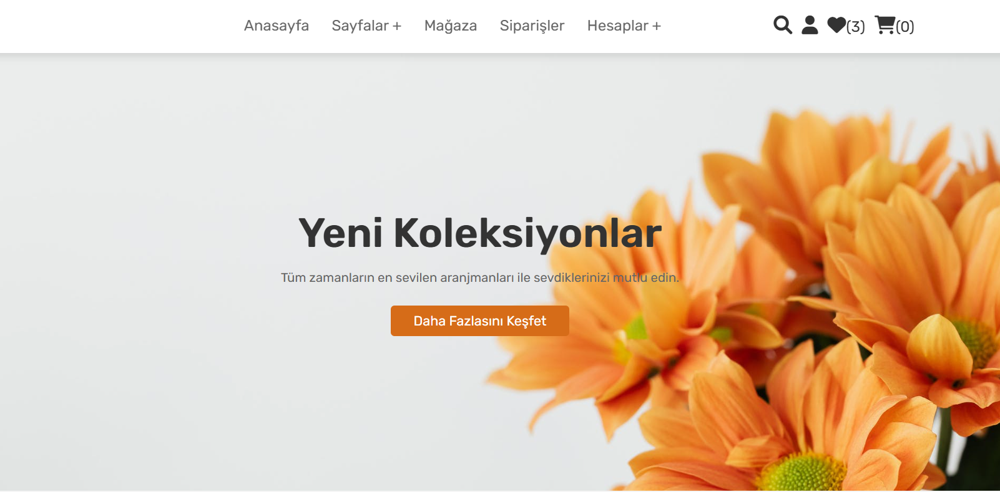
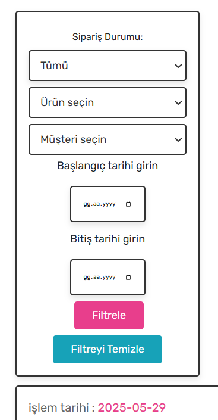
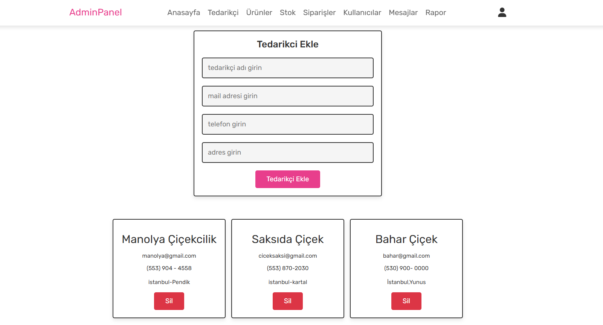
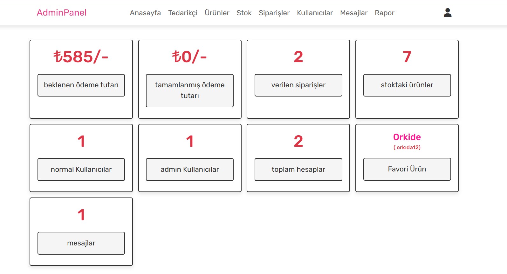
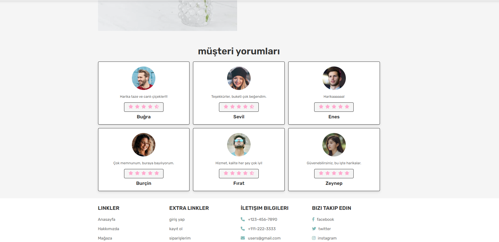
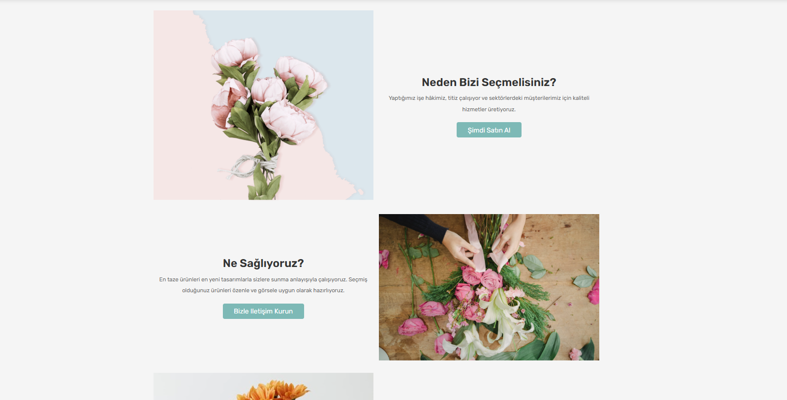
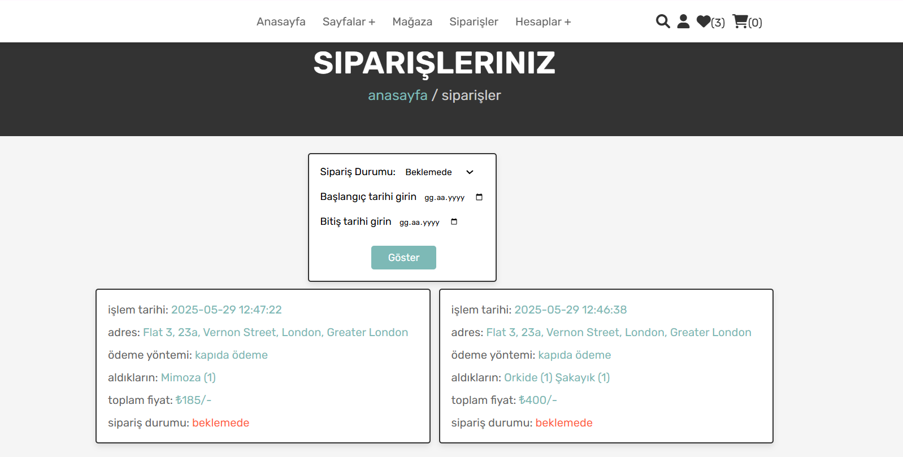
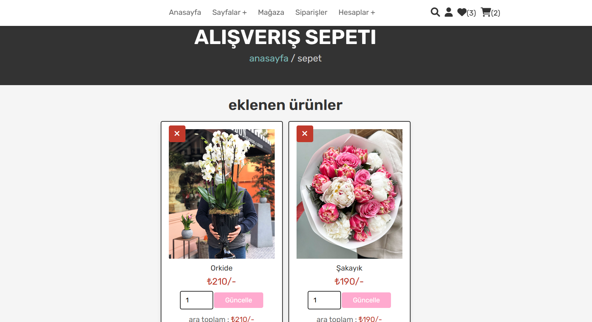
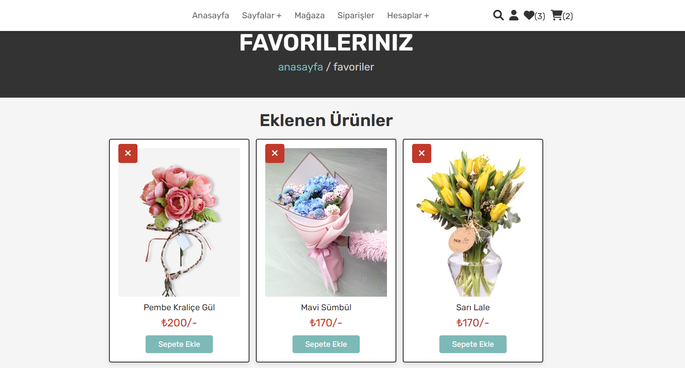

# Çiçek E-Ticaret Projesi

## Proje Tanımı
Bu proje, çiçek satışı yapan bir e-ticaret web uygulamasıdır. Kullanıcılar ürünleri inceleyebilir, sepete ekleyebilir, favorilere alabilir ve sipariş verebilir. Yönetici paneli ile ürün, stok, sipariş, yorum ve kullanıcı yönetimi yapılabilir. Ayrıca satışlarla ilgili raporlamaları inceleyebilir. Rapor ve stok/sipariş bölümlerinde özel filtrelemeler bulunmaktadır.

## Özellikler
- Kullanıcı kaydı ve girişi
- Ürün listeleme ve detayları
- Sepet ve favori listesi yönetimi
- Sipariş oluşturma
- Yönetici paneli (ürün, stok, sipariş, kullanıcı yönetimi)
- İletişim formu

## Kurulum
1. **XAMPP veya benzeri bir sunucu kurun.**
2. Proje dosyalarını `htdocs` klasörüne kopyalayın.
3. `flower (2).sql` dosyasını phpMyAdmin ile içe aktararak veritabanını oluşturun.
4. `config.php` dosyasındaki veritabanı bağlantı ayarlarını kendi ortamınıza göre düzenleyin.
5. Tarayıcıda `http://localhost/flower/home.php` adresine gidin.

## Kullanılan Teknolojiler
- PHP (Backend)
- MySQL (Veritabanı)
- HTML, CSS, JavaScript (Frontend)
- [Font Awesome](https://fontawesome.com/) (ikonlar)

## Klasör ve Dosya Yapısı
```
├── css/
│   └── style.css           # Tüm site stilleri
├── images/                 # Proje görselleri
├── js/
├── uploaded_img/           # Ürün görselleri
├── home.php                # Ana sayfa
├── shop.php                # Ürünler sayfası
├── about.php               # Hakkımızda
├── contact.php             # İletişim
├── ...                     # Diğer PHP dosyaları
├── flower (2).sql          # Veritabanı şeması
└── config.php              # Veritabanı bağlantı ayarları
```

# Proje Ekran Görüntüleri

<table>
  <tr>
    <td></td>
    <td></td>
  </tr>
  <tr>
    <td></td>
    <td></td>
  </tr>
  <tr>
    <td></td>
    <td></td>
  </tr>
  <tr>
    <td></td>
    <td></td>
  </tr>
  <tr>
    <td></td>
    <td></td>
  </tr>
</table>

## Katkı
Katkıda bulunmak için lütfen bir fork oluşturun ve pull request gönderin.

## Lisans
Bu proje eğitim amaçlıdır. Ticari kullanım için lütfen iletişime geçin.

## Proje Tarihi
Bu proje 2023 yılında geliştirilmiştir.
